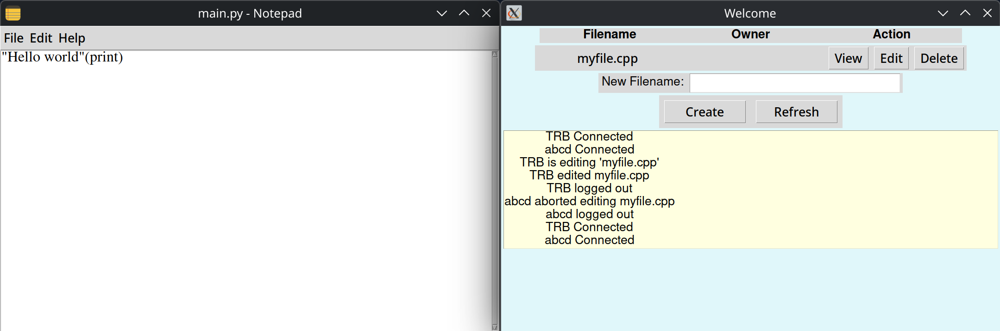
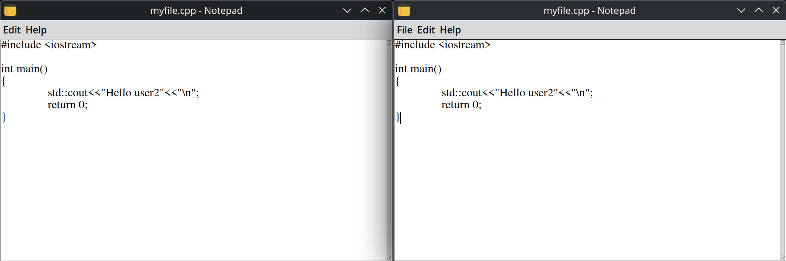

# Server-Client Text File Management System

## Initial Features

- The server manages a list of text files from a host directory.
- The client authenticates with a username and receives the list of text files, along with the username of the client currently editing each file.
- Any authenticated client can request to view the content of a file, in which case the server sends them the latest version of that file from disk.
- A client can request to take a file for editing if it is available. In this case, the server sends the file’s content to the client and notifies all other clients that the file is now being edited by the requesting client.
- The client can update the file’s content by requesting the server to save the new version. In this case, the server updates the file’s content on disk with what it received from the client and notifies all clients who are currently viewing this file with the new content so they can refresh their displayed data.
- The client can release the file from editing, in which case the server notifies all authenticated clients that the file is no longer being edited by the previous editor and is available for editing by others.
- When a file is added to or deleted from the server, it notifies all authenticated clients about the name of the file affected by the operation so they can add or remove it from their local list of available files.

## New Features

Added an file editor to make edititing and creating files easier. Other users can view the file's content when it's being edited by another user. Whenever a user saves the changes, they will be updated in real time.




## Installation Guide

### Client

#### Linux

##### Copy the repository

``` bash
git clone https://github.com/TRBogdann/File-Server.git && cd File-Server
```

##### Run the installer

``` bash
cd client 
chmod +x install.sh
./install.sh
```

And now you will be able to find the client listed in your Applications Menu

##### Configuration

In ~/.config/FileSharing you will see the next JSON:

``` json
{
    "server_adress":"0.0.0.0",
    "server_port":2020,
    "host": "0.0.0.0",
    "sender_port":3030,
    "broadcast_port":3031,
    "allowed_ports":[2021,2022]
}
```

Change the values to match the current server location. The program will not start without an server instance running.

#### Windows

Currently there's no installation guide for Windows. But you can clone the repository and run it. But first make sure to change the paths inside the programs to match the location.

```python
# In client/app.py
class App:
    def __init__(self):
        #Change this to your location
        folder_path = os.getenv('HOME')+"/.file-sharing/cache"
        if not os.path.exists(folder_path):
            os.makedirs(folder_path)
        

        #And this
        config = os.getenv('HOME') + '/.config/FileSharing/config.json'
        icon = os.getenv('HOME') + '/.config/FileSharing/icon.png'
        settings = json.load(open(config))
        
        server_adress = settings["server_adress"]
        server_port = settings["server_port"]
        sender = settings["sender_port"]
        host = settings["host"]
        broadcast = settings["broadcast_port"]
        allowed = []
        for ports in settings["allowed_ports"]:
            allowed.append((server_adress,ports))
        
        self.connectionManager = ConnectionManager((server_adress,server_port),(host,broadcast),(host,sender),allowed)
        self.connectionManager.startBroadcast()
        #... 

        #In client/main_form.py client/fileeditor.py in show or __init__
        icon_image = tk.PhotoImage(os.getenv('HOME')+
        '/.config/FileSharing/icon.png')
        #...

```

### Server

#### Linux

First start by copying the repository

##### Run the installer

``` bash
cd server
chmod +x install.sh
./install.sh
```

##### Change the configurations

```json
{
    "host":"0.0.0.0",
    "port":2020,
    "connection_limit":20
}
```

##### Start server

source .venv/bin/activate
python3 server.py

#### Windows

Change the next paths to match your config location

```python
#1. Users
home = os.getenv('HOME')
connections = []
capacity = 10 
notifications = []
db = UserDataBase(home+'/.file-server/users.db')
edit_permission,create_permission,delete_permission = utils.createPermissions()

#2. Folder
folder = home+'/.file-server/files'
fileManager = FileManager(folder,[edit_permission ,create_permission, delete_permission])


#Socket
config  = home+"/.config/FileServer/config.json"
settings = json.load(open(config))

server = socket.socket(socket.AF_INET, socket.SOCK_STREAM)
server.setsockopt(socket.SOL_SOCKET, socket.SO_REUSEADDR, 1)
server.bind((settings["host"],settings["port"]))
server.listen(settings["connection_limit"])
```

Then run the next commands

```shell
python3 -m venv .venv
pip install tk
python3 .venv/bin/activate
python3 server.py
```
